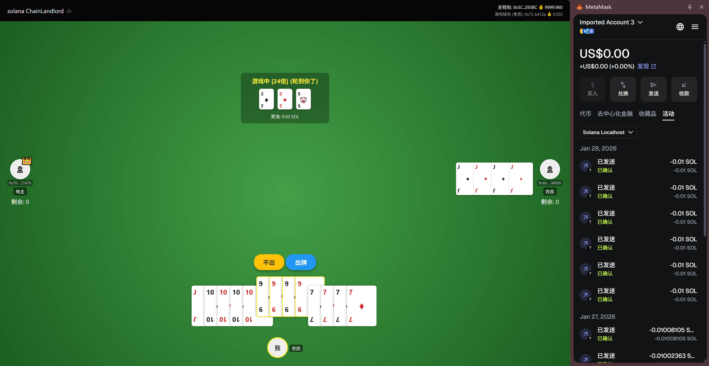

# ChainLandlord - 区块链斗地主游戏 (Solana版本)



## 项目概述

https://chainlandlord11.vercel.app/frontend/index.html  

ChainLandlord 是一款基于Solana区块链的去中心化斗地主游戏，利用Solana交易处理速度快的特点，支持了游戏全过程上链，避免了游戏被中心化的庄家操纵，且可历史游戏记录可查。拥有完整的斗地主规则，包括单张、对子、三张、三带一、三带二、顺子、炸弹和火箭等牌型。该游戏创新性地支持临时钱包代理操作，让玩家可以使用临时钱包进行游戏操作，而不用频繁签署交易，而收益会自动归集到主钱包，提供安全便捷的游戏体验。

## 主要功能

- **完整斗地主规则**：支持所有经典斗地主牌型和规则
- **临时钱包支持**：使用 burner wallet 进行游戏操作，收益自动归集到主钱包
- **实时多人游戏**：支持3人同台竞技，实时交互
- **自动结算**：游戏结束后自动分配奖励并扣除协议费用
- **直观界面**：提供美观的前端界面，支持实时游戏状态更新
- **叫分机制**：支持经典的叫分争当地主机制

## 技术栈

- **智能合约**：Rust + Anchor Framework
- **开发框架**：Anchor + Solana
- **前端技术**：HTML/CSS/JavaScript + Solana Web3.js
- **区块链**：Solana Devnet/Testnet

## 安装与运行步骤

### 环境准备

1. 确保已安装 Node.js (v16 或更高版本)
2. 安装 Solana CLI 工具套件
   ```bash
   sh -c "$(curl -sSfL https://release.solana.com/stable/install)"
   ```
3. 安装 Anchor 框架
   ```bash
   cargo install --git https://github.com/coral-xyz/anchor avm --locked
   avm install latest
   avm use latest
   ```
4. 克隆项目仓库

### 合约部署

1. 进入合约目录：
   ```bash
   cd chainlandlord-sol
   ```

2. 安装依赖：
   ```bash
   npm install
   anchor build
   ```

3. 配置 Solana 网络：
   ```bash
   # 切换到 devnet
   solana config set --url devnet
   # 或者使用本地测试网
   solana config set --url localhost
   ```

4. 部署合约到 Solana：
   ```bash
   # 部署到 devnet
   anchor deploy --provider.cluster devnet
   
   # 或者本地测试
   anchor test
   ```

### 前端运行

1. 进入前端目录：
   ```bash
   cd frontend
   ```

2. 安装前端依赖：
   ```bash
   npm install
   ```

3. 启动前端服务：
   ```bash
   npm run dev
   ```

4. 在浏览器中访问 `http://localhost:3000` 即可开始游戏

## 部署信息

- **已部署合约地址**: (根据实际部署更新)
- **入口费用**: 0.001 SOL
- **协议费用**: 5%

## 游戏规则

1. **加入游戏**：支付 0.001 SOL 入场费加入游戏
2. **叫分阶段**：依次叫分（1分、2分、3分）争当地主
3. **发牌阶段**：确定地主并分发底牌
4. **出牌阶段**：按顺序出牌，必须大于上家出的牌
5. **胜负判定**：先出完手中牌的玩家获胜

## 特色功能详解

### 临时钱包机制
- 使用 burner wallet 进行日常游戏操作
- 收益自动归集到指定的受益人钱包
- 提高安全性，避免主钱包频繁操作

### 完整牌型支持
- **单张**：一张牌
- **对子**：两张相同点数的牌
- **三张**：三张相同点数的牌
- **三带一**：三张+一张
- **三带二**：三张+一对
- **顺子**：连续五张或以上单牌
- **炸弹**：四张相同点数的牌
- **火箭**：双王（最大牌型）

### 自动化游戏流程
- 自动洗牌和发牌
- 实时验证出牌合法性
- 自动结算奖励和抽成

## 本地开发设置

### 启动本地测试网
```bash
# 配置为本地网络
solana config set --url localhost

# 生成新钱包（如果没有）
solana-keygen new --outfile ~/.config/solana/id.json

# 启动本地验证节点
solana-test-validator
```

### 构建和部署
在另一个终端窗口：
```bash
# 构建程序
anchor build

# 获取程序 ID
solana address -k target/deploy/chain_landlord-keypair.json

# 将程序 ID 更新到 lib.rs 的 declare_id!
# 然后重新构建
anchor build

# 部署
anchor deploy

# 测试
anchor test --skip-local-validator
```

## 项目结构

```
ChainLandlord_sol/
├── programs/                 # Anchor 程序源码
│   └── chain-landlord/       # 斗地主游戏核心逻辑
├── migrations/              # 部署脚本
├── tests/                   # 测试文件
├── Anchor.toml              # Anchor 配置文件
├── Cargo.toml               # Rust 依赖配置
└── frontend/                # 前端应用
    ├── public/
    ├── src/
    ├── package.json
    └── index.html
```
